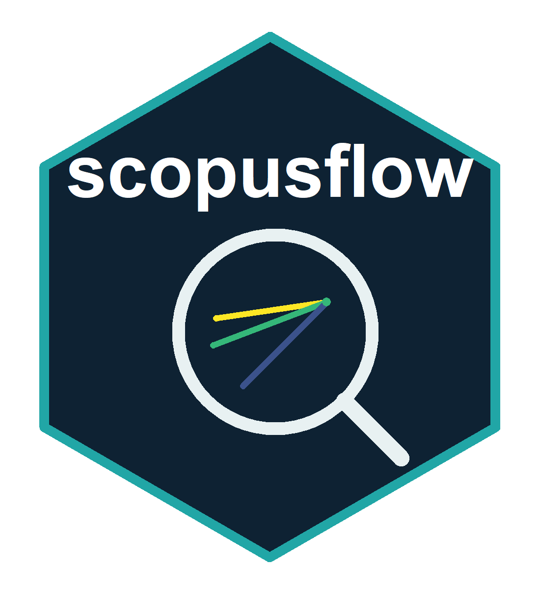
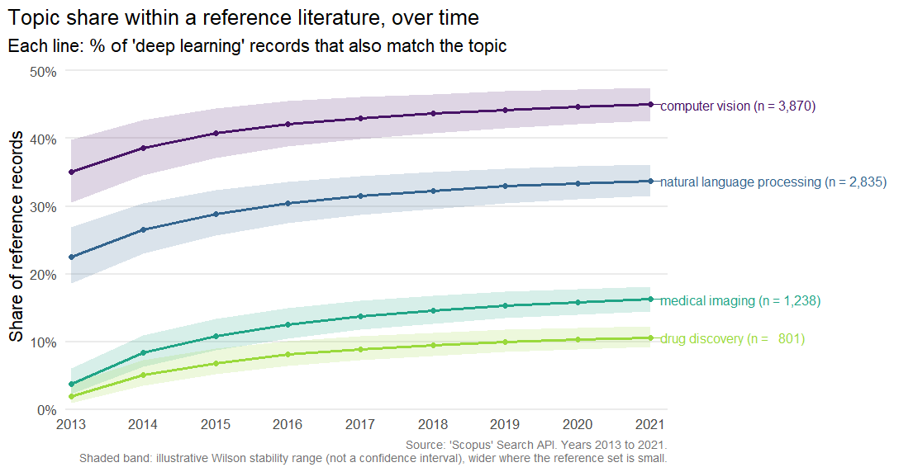

<!-- README.md is generated from README.Rmd. Please edit that file -->

# scopusflow <small>(R)</small> 

<!-- badges: start -->

[](https://github.com/pablobernabeu/scopusflow/actions/workflows/R-CMD-check.yaml)
[](https://lifecycle.r-lib.org/articles/stages.html#experimental)
[](https://opensource.org/license/MIT)
<!-- badges: end -->

scopusflow is a reproducible, quota-aware workflow layer over the
Elsevier [Scopus](https://dev.elsevier.com/sc_apis.html) Search API. It
turns one-off bibliographic queries into inspectable plans, retrieves
records safely with pagination, rate-limit handling, retry with back-off
and optional resumable caching, normalises them to a stable tidy schema,
tracks changes in DOI sets over time, sizes sets of concepts and their
intersections and compares publication trends across topics.

This is the feature-parity twin of [the Python
package](https://pablobernabeu.github.io/scopusflow-py/) of the same
name, which offers the same workflow on top of
[pybliometrics](https://pybliometrics.readthedocs.io).



The figure is drawn by `plot_scopus_comparison()` from illustrative
counts rather than a live retrieval, so that this page builds without an
API key. The [Comparing topics over
time](https://pablobernabeu.github.io/scopusflow/articles/comparing-topics.html)
article builds the same table and explains every column.

> Scopus is a trademark of Elsevier. scopusflow is an independent client
> and is not affiliated with or endorsed by Elsevier. You will need your
> own Elsevier API key and should use it under Elsevier’s API terms.

## Installation

``` r
# install.packages("pak")
pak::pak("pablobernabeu/scopusflow")
```

## API key

scopusflow never stores your key. It is read, in order, from the
`api_key` argument, the `scopusflow.api_key` option, or the
`SCOPUS_API_KEY` environment variable. Store it in `~/.Renviron`:

    SCOPUS_API_KEY=your-key-here
    # Optional, for off-campus access to subscriber content:
    SCOPUS_INST_TOKEN=your-institutional-token

``` r
library(scopusflow)
scopus_has_key()
#> [1] TRUE
```

## The workflow in brief

With a key configured, a search runs as a plan: compose the query, size
it, execute it with caching, then export or analyse the result. These
calls contact the API and consume quota, so they are not run here:

``` r
# Compose a field-tagged query, then a reproducible plan partitioned by
# year to stay under the API's start < 5000 ceiling.
q <- scopus_query("perovskite", "solar cell", .field = "TITLE-ABS-KEY")
plan <- scopus_plan(q, years = 2012:2022, partition = "year")

# Size the search before spending quota, then execute, caching each year
# so an interrupted run can resume.
scopus_count(q, years = 2012:2022)
records <- scopus_fetch_plan(plan, cache_dir = scopus_cache_dir(), resume = TRUE)

# Save a clean DOI list, or export the records for a reference manager
# (Zotero, EndNote, Mendeley) or a LaTeX bibliography.
scopus_extract_dois(records, file = file.path(tempdir(), "dois.csv"))
as_bibtex(records, file = file.path(tempdir(), "records.bib"))
```

The [Get
started](https://pablobernabeu.github.io/scopusflow/articles/scopusflow.html)
vignette walks this workflow offline, on records bundled with the
package, and the
[articles](https://pablobernabeu.github.io/scopusflow/articles/index.html)
each cover one part in depth: designing queries, search plans and quota,
building a reference set, analysing and visualising a literature
(trends, top sources and authors, concept intersections, abstracts and
cursor-paged harvests), author keywords and references, comparing topics
over time (the chart above) and tracking how a literature changes
between retrievals.

## Code-free app

`run_app()` opens a local Shiny app that drives the whole workflow
without writing code, and mirrors every choice back as a runnable R
script, so it works as an on-ramp to the package rather than a
replacement. It runs on your own machine, so your API key never leaves
it, and a demo mode lets you try the flow with no key, on the corpus of
real articles bundled with the package.

``` r
run_app()
```

The retrieval runs in a background process with a live progress
terminal, and records appear as a table and as plots with one-click
export. It needs the suggested packages shiny, bslib and callr. The
[Using the code-free
app](https://pablobernabeu.github.io/scopusflow/articles/using-the-app.html)
article walks through every panel.

## Quotas, rate limits and errors

The Scopus API enforces a weekly quota and a short-term rate limit, and
ordinary offset paging returns at most the first 5000 records of any
query (use `scopus_fetch(cursor = TRUE)` to go beyond that). scopusflow
works within these limits rather than around them. It requests the
largest page each view allows, 200 records for `STANDARD` and 25 for
`COMPLETE`, so that a retrieval uses as few requests, and as little
quota, as it can. This is the same approach `rscopus` takes. The quota
and rate-limit headers are parsed by `scopus_quota()`, transient
failures such as HTTP 429 and the 5xx range are retried with back-off
that honours `Retry-After`, and an offset-paged query is capped at 5000
records with a warning that suggests cursor paging or partitioning by
year. A failure arrives as a typed condition (every `scopus_error_*`
condition inherits from `scopus_error`), so a workflow can respond to it
in code. The Get started vignette shows the `tryCatch()` pattern.

## How it compares

| Package | Focus | Relationship to scopusflow |
|----|----|----|
| [`rscopus`](https://cran.r-project.org/package=rscopus) | Low-level Scopus API wrapper | scopusflow sits at a higher workflow layer (plans, quotas, caching, diffs) and calls the API directly through `httr2` |
| [`openalexR`](https://cran.r-project.org/package=openalexR), [`pubmedR`](https://cran.r-project.org/package=pubmedR), [`dimensionsR`](https://cran.r-project.org/package=dimensionsR), [`rcrossref`](https://cran.r-project.org/package=rcrossref) | Other bibliographic databases | Complementary, covering different sources |
| [`bibliometrix`](https://cran.r-project.org/package=bibliometrix) | Science mapping and analysis | Downstream, and fed by `as_bibliometrix()` |

## Limitations

A few limits are worth keeping in mind. Under ordinary offset paging the
Scopus Search API returns at most the first 5000 records of a query, so
a large search is best partitioned by year with `scopus_plan()` or
harvested in one pass with `scopus_fetch(cursor = TRUE)`, which trades
relevance order for completeness. `as_bibliometrix()` maps the core
descriptive fields the Search API returns; structured reference lists
are available through `scopus_abstract(include = "references")` and
`scopus_corpus()`, but an analysis that needs full affiliations, or
bibliometrix’s own cited-reference (CR) field, will still call for a
complete Scopus export. What you can retrieve also depends on your
Elsevier entitlement, and some fields are available only in the
`COMPLETE` view and to subscribers.

## Citation

``` r
citation("scopusflow")
```

The [About
page](https://pablobernabeu.github.io/scopusflow/articles/about.html)
carries the same citation with a BibTeX entry, and a short note on the
developer.

## Licence

MIT. ‘Scopus’ is a trademark of Elsevier. This package is an independent
client and is not affiliated with or endorsed by Elsevier.

## Contributing

Issues and pull requests are welcome. The [contributing
guide](https://github.com/pablobernabeu/scopusflow/blob/main/.github/CONTRIBUTING.md)
describes the development setup and the conventions the package follows,
and everyone taking part is asked to honour the [Code of
Conduct](https://github.com/pablobernabeu/scopusflow/blob/main/.github/CODE_OF_CONDUCT.md).

Alongside the per-commit checks on Windows, macOS and several versions
of R, a scheduled job re-checks the package every other day against the
current and development versions of its dependencies, so that breakage
from an upstream change is caught early. The contributing guide
describes how it reports, and tries to resolve, any problem it finds.
