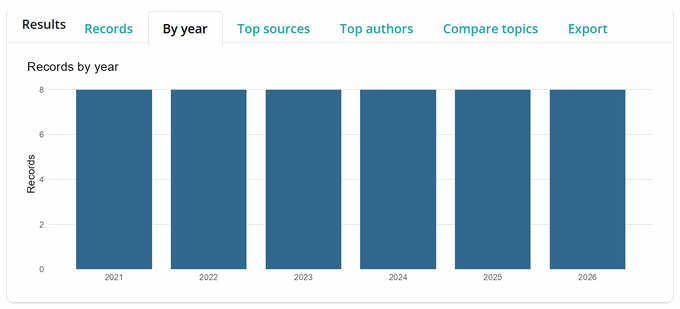

```{r, include = FALSE}
knitr::opts_chunk$set(collapse = TRUE, comment = "#>", eval = FALSE)
```

<!-- The screenshots in figures/ were captured from run_app() with Demo mode
     left on, so they need no key and no network. Recapture them whenever the
     app's layout changes: unlike the figures in the other articles, which are
     drawn when the vignette is knitted, a static image of an interface drifts
     silently. -->


Not every search starts in an editor. `run_app()` opens a local Shiny app that
drives the whole scopusflow workflow through a browser tab, from describing a
search to exporting the records, without writing any R. It runs on your own
machine, so your Scopus key never leaves it and requests come from your own
network. The app is an on-ramp to the package rather than a replacement, because
it mirrors every choice you make back as a runnable R script. Anything you can do
in the app you can also do from code, and the script panel shows you how.

This article describes the app rather than running it, since it needs a live
server, so the code chunks are shown but not evaluated. The screenshots were
taken from the running app with Demo mode left on, which needs no key and no
network, so everything they show can be reproduced on your own machine in a
minute.

## Launching the app

The app needs the suggested packages shiny, bslib and callr, and ggplot2 for the
plots. With those installed, one call opens it.

```{r}
library(scopusflow)
run_app()
```

By default it listens only on `127.0.0.1`, so it is reachable from your own
machine alone, and it opens your browser at the address it prints. Passing
`launch.browser = FALSE` leaves the browser to you, and `port` fixes the port
when you need a stable address.

## Demo mode

Demo mode is switched on when the app opens, so you can walk the whole flow with
synthetic data and no key at all. With it on, the harvest is simulated, the live
terminal still streams its per-cell progress, the tables and plots still render,
and the Compare topics tab still draws a figure. It is the quickest way to learn
where each control sits before you spend any quota. The synthetic records carry
the same schema a real harvest returns, so every panel behaves as it will against
the live API. When you are ready for real results, paste your Scopus key into the
field at the top of the sidebar and switch Demo mode off. The key stays in the
running session and is never written into the generated script.

## Describing and sizing a search

The sidebar is where you describe the search. You enter your terms, choose which
field to search in, set a year range, and pick the level of detail. Partitioning
by year is recommended and switched on by default, because it keeps each cell
under the API's offset ceiling, the same reasoning behind a partitioned
`scopus_plan()` in code. Check size runs a cheap count first, the same one
`scopus_count()` performs, so you can see how much a query would retrieve before
committing to it. In demo mode it reports how many synthetic records it would
make instead.


## Fetching, with a live terminal

Fetch records starts the harvest in a background process, so the app stays
responsive while it works. The Live terminal panel tails the worker's output,
streaming a line as each year-cell completes, and a progress bar tracks how far
through the plan the run has reached. Cancel stops the run cleanly. Under the
surface the app builds a `scopus_plan()` from your choices and hands it to
`scopus_fetch_plan()` with a cache directory and resume turned on, so an
interrupted or quota-limited run picks up where it left off.


## The reproducible code panel

The Reproducible code panel is what turns the app into a tutorial. It mirrors
every choice you make, the query, the field, the years, whether you partition by
year, and the Compare topics options, and rewrites a runnable R script as you go.
Change a control and the script updates at once, so you can see exactly which
argument each choice sets. The key never appears in the script. The panel notes
that it is read from the `SCOPUS_API_KEY` environment variable, so a script you
share carries the method but not your credentials. Download script saves exactly
what you see.


## Reading the results

When the run finishes, the Results tabs come to life. Records shows a table of
titles, years, sources and citations. By year draws the publications-per-year
trend through `autoplot()`. Top sources and Top authors tally the most frequent
of each with `scopus_top()` and `plot_scopus_top()`. Every figure is drawn by the
same library functions you would call from a script, so the app shows you nothing
you could not reproduce.



## Comparing topics

The Compare topics tab asks a different question from a harvest. Rather than
retrieving records, it measures how a set of sub-topics co-occur with your search
over time, as a share of it, with your search terms acting as the reference
topic. You enter comma-separated comparison terms, optionally pick one to
highlight, and toggle the stability band and whether record counts appear on the
labels. Because each term needs one count request per year, the tab shows how
many requests a comparison will make and warns when the grid grows large. In demo
mode the comparison is synthesised so you can see the figure offline. With a key
it calls `scopus_compare_topics()` and draws the result with
`plot_scopus_comparison()`, the same figure the package produces, and a
Comparison download saves the underlying numbers as a CSV.

## Exporting

Every result the app shows comes with one-click export. The records can be saved
as an RDS file, as a clean DOI list, and as BibTeX and RIS for a reference
manager such as Zotero or EndNote, drawn from `as_bibtex()` and `as_ris()`. The
comparison can be saved as a CSV. None of this contacts the API again, because it
works on results already in hand. Between the downloaded script and the exported
records, a session in the app leaves you with both the data and the code that
produced it.
